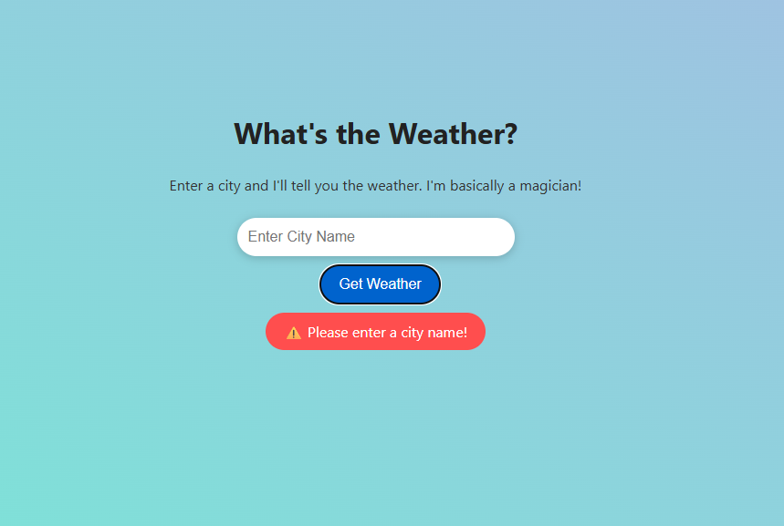
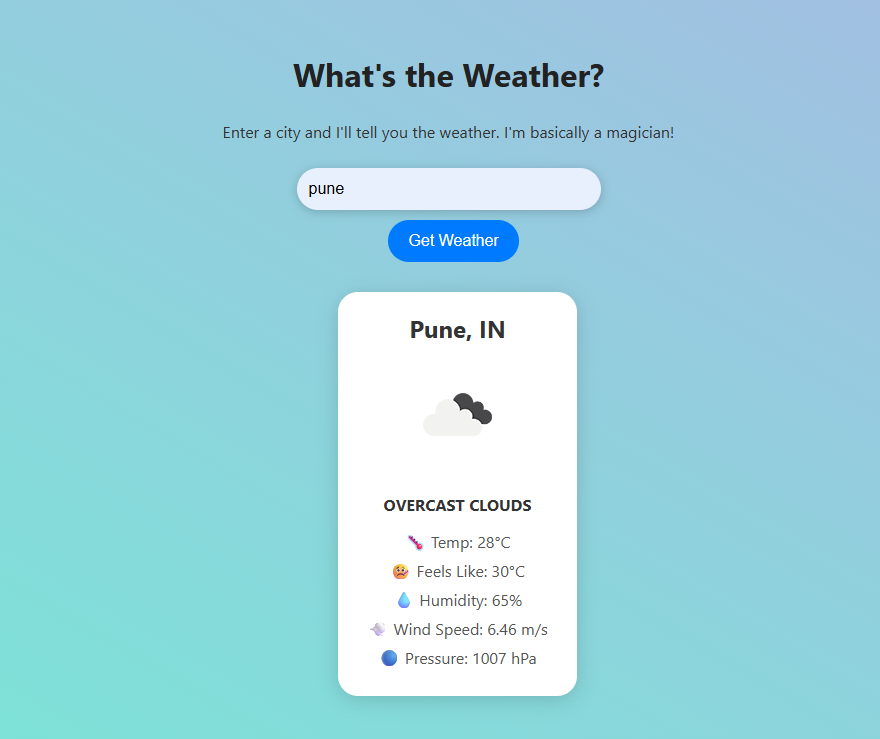

# 🌤️ Weather App

- A simple and stylish weather application where users can enter a city name to get the current weather using a public weather API.

## 📌 Features

- 🌍 Fetches real-time weather for any city

- ⛅ Displays temperature, wind, pressure, humidity, and weather condition

- 🌡️ Converts temperature to °C from Kelvin

- ⚠️ Shows animated error popup if city is not entered or invalid

- 🌀 Circular loader while data is fetching

- 📱 Fully responsive design using media queries

- 🌈 Weather icons shown based on conditions

## 🚀 Tech Stack

- HTML5 – Structure

- CSS3 – Styling and animations

- JavaScript (Vanilla) – Logic and API integration

- OpenWeatherMap API (via RapidAPI) – Weather data source

## 🛠️ Setup Instructions

i) Clone the repository:
`bash 
    git clone https://github.com/your-username/weather-app.git
    cd weather-app
    `
ii) Update the API Key:

- Replace the value of x-rapidapi-key in index.js with your own RapidAPI key.

iii)Run the app:

- Open index.html in your browser.

## 📁 Project Structure

```bash
weather-app/
│
├── index.html
├── styles.css
├── index.js
└── README.md

```

## Screenshot





## [🚀 View Live Demo]()
